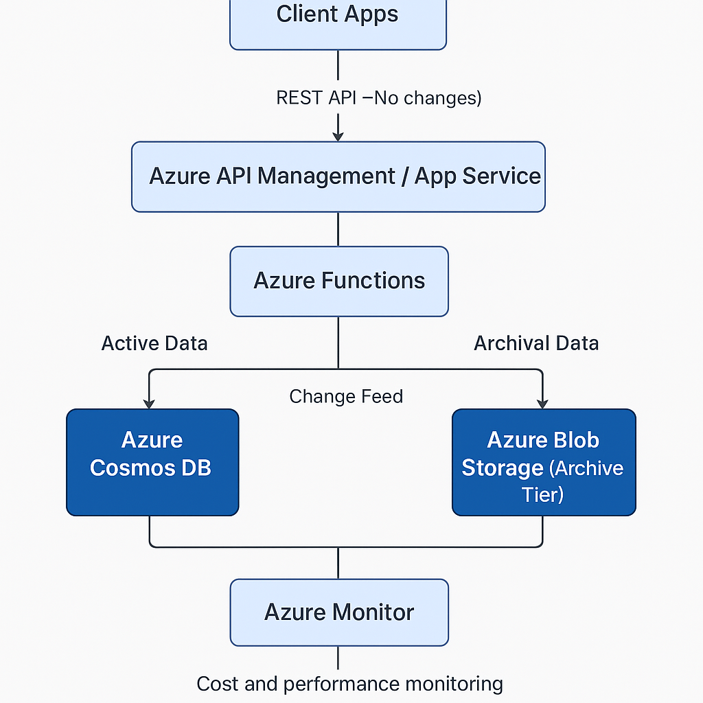

# AzureBillingCostOptimizer

This repository contains a cost optimization solution for a read-heavy Azure Cosmos DB storing 2 million billing records (300 KB each, ~600 GB), with records older than three months rarely accessed. The solution reduces costs by ~73% (from ~$150/month to ~$39.25/month) while ensuring simplicity, no data loss, no downtime, and no changes to existing API contracts.

## Problem Statement

The system uses Azure Cosmos DB in serverless mode, with high storage costs due to database growth. Records older than three months are rarely accessed but must be available within seconds. The solution must:
- Be simple to deploy and maintain.
- Prevent data loss and service downtime.
- Preserve existing read/write API contracts.
- Ensure seconds-scale latency for archived records.

## Solution Overview

The solution implements a **tiered storage approach**:
- **Active Data**: Records <3 months old stay in Azure Cosmos DB (serverless) for low-latency access.
- **Archived Data**: Records >3 months old move to Azure Blob Storage (Archive tier) for cost efficiency.
- **Archival**: Azure Functions, triggered by Cosmos DB Change Feed, archive records and set TTL.
- **Read API**: Azure Functions query Cosmos DB or Blob Storage transparently.
- **Monitoring**: Azure Monitor tracks costs and performance.

For technical details, see [Solution.md](Solution.md).

### Architecture Diagram



*Clients interact via APIs (Azure API Management/App Service). Azure Functions handle read/write, querying Cosmos DB or Blob Storage. Change Feed triggers archival. Azure Monitor oversees performance.*

## Repository Structure

```
AzureBillingCostOptimizer/
├── src/
│   ├── archive_records.py         # Azure Function for archival
│   ├── read_record.py            # Azure Function for read API
├── scripts/
│   ├── enable_ttl.sh             # Azure CLI script for Cosmos DB TTL
│   ├── setup_blob_storage.sh     # Azure CLI script for Blob Storage setup
├── diagrams/
│   ├── architecture.png          # Solution architecture diagram
├── conversation_log.md           # AI interaction log
├── Solution.md                   # Detailed solution description
├── deployment.md                 # Deployment instructions
├── README.md                     # This file
```

## Getting Started

1. **Clone the Repository**:
   ```bash
   git clone https://github.com/epneo-banuprakash/azure-billing-cost-optimizer
   cd azure-billing-cost-optimizer
   ```

2. **Follow Deployment Instructions**:
   See [deployment.md](deployment.md) for steps to set up Azure Cosmos DB, Blob Storage, Functions, and Monitor.

3. **Key Files**:
   - [Solution.md](Solution.md): Technical details, cost savings, and failure mitigations.
   - [conversation_log.md](conversation_log.md): Log of AI interactions with Grok 3 (xAI).
   - `src/`: Azure Function code for archival and read API.
   - `scripts/`: Azure CLI scripts for resource configuration.

## Key Features

- **Cost Savings**: Reduces storage costs by 73% using Blob Storage Archive tier.
- **Seamless Access**: APIs query Cosmos DB or Blob Storage without contract changes.
- **Reliability**: No data loss or downtime; robust error handling.
- **Monitoring**: Azure Monitor tracks RU usage, failures, and rehydration delays.
- **Scalability**: Serverless architecture handles thousands of users.

## Cost Savings

- **Current**: ~$151.25/month (600 GB in Cosmos DB).
- **Proposed**: ~$39.25/month (150 GB in Cosmos DB, 450 GB in Blob Storage Archive).
- **Savings**: ~$112/month (73%).

## Deployment

Follow [deployment.md](deployment.md) to:
- Set up Cosmos DB with TTL.
- Configure Blob Storage with lifecycle policy.
- Deploy Azure Functions for archival and API.
- Enable Azure Monitor alerts.

## AI Interaction

This solution was developed with assistance from Grok 3 (xAI). See [conversation_log.md](conversation_log.md) for details on prompts and responses used to refine the solution.

## Contributing

Open issues or submit pull requests for improvements. Ensure changes align with requirements (no data loss, no downtime, unchanged APIs).


## Contact

For questions or CI/CD setup assistance, use GitHub Issues or contact [epneo-banuprakash].